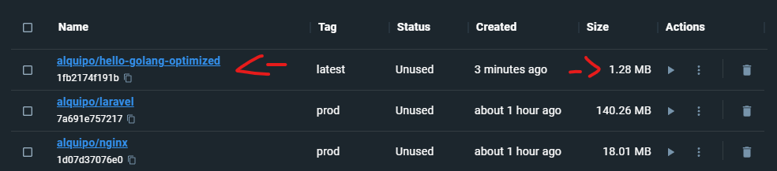

# Desafio 01: Desafio GO
Este repositório contém uma versão otimizada da imagem Docker para executar um simples programa "Hello World" escrito em Go. A otimização foi realizada aplicando algumas modificações no Dockerfile original, resultando em uma imagem mais leve e eficiente. A imagem otimizada está disponível no Docker Hub: [alquipo/hello-golang-optimized](https://hub.docker.com/r/alquipo/hello-golang-optimized).

### Otimizações realizadas

1. Utilização da imagem base golang:alpine em vez da imagem golang. A imagem Alpine é menor e mais leve que a imagem padrão.

2. Desabilitação do suporte a CGO e especificação do sistema operacional para Linux. Essas configurações ajudam a criar um binário com melhor desempenho e menor tamanho.

3. Redução do tamanho do binário gerado utilizando a flag -ldflags="-s -w" durante a compilação. Essa flag remove informações de depuração e símbolos da tabela, diminuindo o tamanho do binário.

4. Desabilitação do suporte à depuração do binário com a flag -gcflags="all=-N -l".


### Dockerfile otimizado

```Dockerfile
# Etapa de compilação
FROM golang:alpine as builder
WORKDIR /go
COPY . .
RUN CGO_ENABLED=0 GOOS=linux go build -ldflags="-s -w" -gcflags="all=-N -l" -o hello hello.go

# Etapa final
FROM scratch
COPY --from=builder /go/hello /
ENTRYPOINT ["/hello"]


```
### Resultado
<h4 align="center">
    
</h4>

## Como baixar a imagem do Docker Hub

1. Instale o [Docker](https://www.docker.com/) em sua máquina.
2. Execute o seguinte comando para baixar a imagem otimizada do Docker Hub:

```bash
docker pull alquipo/hello-golang-optimized
```

## Como executar a imagem

Após baixar a imagem, você pode executá-la com o seguinte comando:

```bash
docker run --rm alquipo/hello-golang-optimized
```

Ao executar o comando, você verá a mensagem "Hello World!" sendo impressa no terminal.


## Como construir a imagem localmente

Caso queira construir a imagem localmente a partir do Dockerfile otimizado, siga estas etapas:

1. Abra um terminal e navegue até a pasta onde está localizado o Dockerfile otimizado.
2. Execute o seguinte comando para construir a imagem Docker:

```bash
docker build -t hello-golang-optimized .
```

Em seguida, siga as instruções na seção "Como executar a imagem" acima para executar a imagem construída localmente.

## 🤔 Como contribuir para o projeto

- Faça um **fork** do projeto;
- Crie uma nova branch com as suas alterações: `git checkout -b my-feature`
- Salve as alterações e crie uma mensagem de commit contando o que você fez:`git commit -m "feature: My new feature"`
- Envie as suas alterações: `git push origin my-feature`

> Caso tenha alguma dúvida confira este [guia de como contribuir no GitHub](https://github.com/firstcontributions/first-contributions)


## 📝 Licença

Este projeto esta sobe a licença MIT. Veja a [LICENÇA](https://opensource.org/licenses/MIT) para saber mais.

Feito com ❤️ por Alquipo Neto 👋🏽 [Entre em contato!](https://www.linkedin.com/in/alquiponeto/)

</h3>
